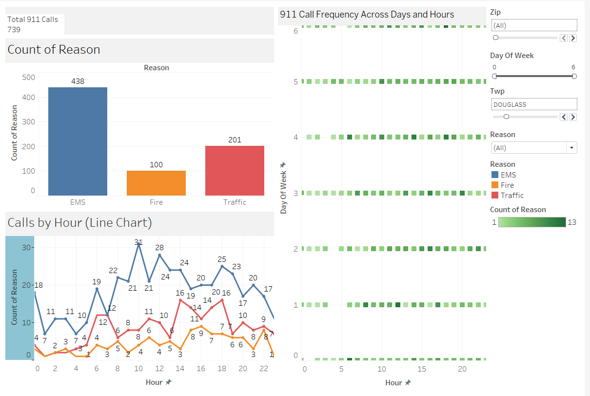

# 911 Emergency Call Data Analysis

## Project Overview
This project analyzes 911 emergency call data . The main goal is to explore, visualize, and derive insights from the dataset to understand patterns in emergency calls.

## Dataset Description
- `lat`: Latitude of the call
- `lng`: Longitude of the call
- `desc`: Description of the emergency
- `zip`: Zipcode
- `title`: Type and reason of the emergency (e.g., EMS, Fire, Traffic)
- `timeStamp`: Date and time of the call (YYYY-MM-DD HH:MM:SS)
- `twp`: Township
- `addr`: Address
- `e`: Dummy variable (always 1)

## Tools and Libraries
- Python 3
- Pandas, NumPy for data manipulation
- Matplotlib, Seaborn for data visualization

## How It Works
1. **Load and Inspect Data**:
   - Load CSV data using pandas.
   - View structure, null values, and basic statistics.

2. **Feature Engineering**:
   - Extract main emergency type from `title`.
   - Convert `timeStamp` to datetime.
   - Derive new columns like `Hour`, `Month`, `Day of Week`.

3. **Exploratory Data Analysis**:
   - Count plots for each emergency type.
   - Time-based analysis (hourly, daily, monthly trends).
   - Heatmaps to visualize call volume by hour and day.
   - Plot call distribution by township and zipcode.

4. **Geospatial Analysis**:
 - Plot locations of emergency calls using latitude and longitude.

##  Key Insights
- Most calls are EMS-related.
- Peak call times vary by type (e.g., Traffic peaks during rush hours).
- Certain townships have consistently higher call volumes.
- Emergency call volume is relatively stable across months with slight peaks in specific periods.

##  Output
- Cleaned and enriched dataset
- Visualizations for each major trend
- Summary of insights from the data

##  Usage
1. Clone or download the repository.
2. Run the notebook `911_Call_Data_Capstone_Project.ipynb` in a Jupyter environment.
3. Follow along with the EDA steps and visualizations.

## 📊 Interactive Tableau Dashboard

This interactive Tableau dashboard visualizes key insights from the 911 emergency call data.  
It includes:

- Total call count by reason (EMS, Fire, Traffic)
- Calls by hour across the day for each emergency type
- Heatmap showing 911 call frequency across days and hours
- Filters for Township, Zip, Day of Week, and Emergency Type

📸 Dashboard Preview:

🔗 [Click here to view the full Tableau Dashboard](https://public.tableau.com/app/profile/narsimha.reddy.akiti/viz/911EmergencyCallsDashboard/Dashboard1?publish=yes)

---

## Conclusion
This project demonstrates how to process, explore, and extract meaningful insights from real-world emergency call data using Python.

##  Conclusion
This project demonstrates how to process, explore, and extract meaningful insights from real-world emergency call data using Python.

## Output Summary
- Visuals showing call distribution by type (EMS, Fire, Traffic)
- Trends in emergency calls across different times and days
- Geographical heatmaps based on call volume by township
- Peak hours and days with the highest number of 911 calls
